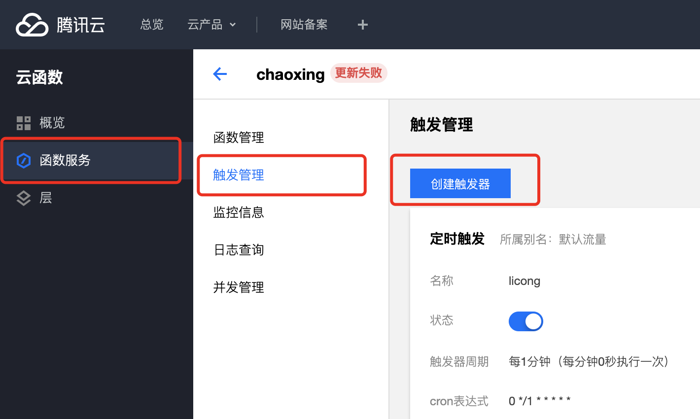
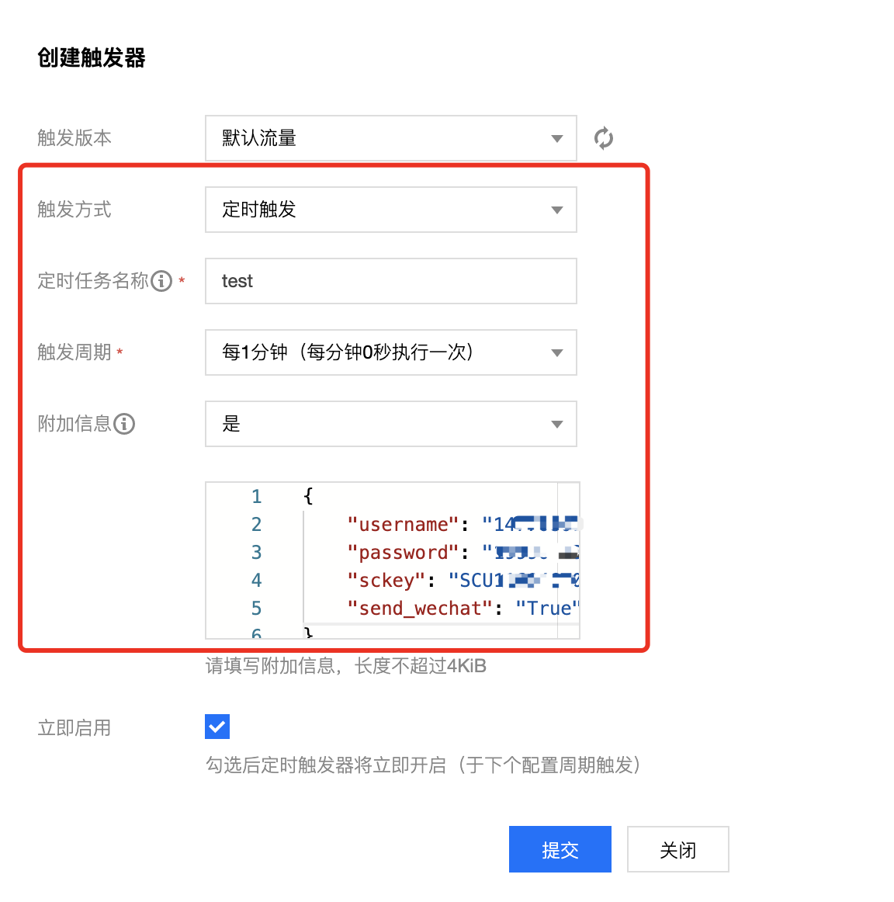
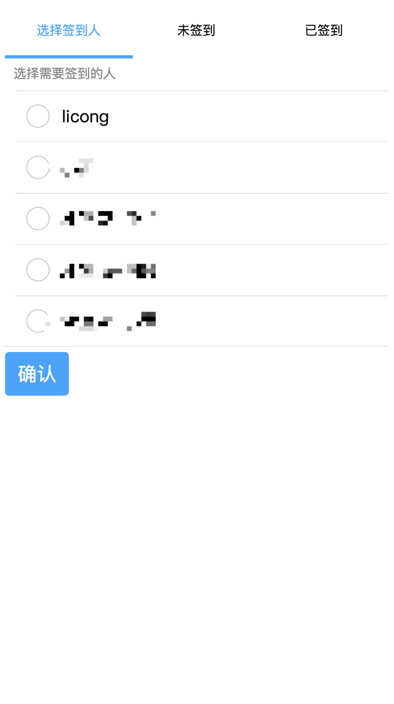

## 前言
该脚本能够让你抛弃学习通签到的干扰，努力学习，专心听课

## 特点
* 支持二维码、手势、位置等所有签到模式
* 支持 Server 酱微信消息推送
* 支持 docker+docker-compose 一键部署
* 支持让同学帮你扫码签到，再也不用担心二维码过期，也不用带多余的手机了

## 快速使用
请先注册Server酱，以便接收微信推送签到消息

[Server酱注册地址](http://sc.ftqq.com/3.version)

注册绑定微信后有一个`SCKEY`，填入到下面部署的参数里

这里推荐两种方式部署：服务器部署、腾讯云函数

### 服务器部署（推荐）

前提是服务器需要有`docker/docker-compose`环境

1. 克隆代码到服务器

```
git clone https://github.com/ncuhome/chaoxing 
```

2. 编辑 `account.json` 按格式添加你的账号

```json
[
  {
    "name": "姓名，用于备注",
    "username": "13688888888",
    "password": "123456",
    "sckey": "SCU*****",
    "send_wechat": true,
    "api_key": "随机字符串" // 可选的，可以用于代扫码签到
  }
]
```

3. 启动容器

```
docker-compose up -d
```

4. 添加/修改账号时直接修改`account.json`文件就可以了，不需要重启容器

### 腾讯云函数
腾讯云函数是可以白嫖的，每个月100万次免费调用，对于1分钟检查一次签到的需求完全够用，但网络流量需要收点费用

**腾讯云函数不支持二维码签到**，且需要准备一台 Redis 服务器，用于缓存登陆、签到记录

1. 将本仓库克隆到本地 `git clone https://github.com/exqlnet/chaoxing_sign`
2. 修改 cx_tx_scf.py 下的 `<redis-host>` 为你的 redis 服务器地址，如果不是默认端口，`redis_port`也要修改
3. 修改 account.json 按照格式将你的帐号信息填入进去
4. 执行 `make txscf` 得到 cx.zip
5. 创建一个 Python3.6 运行环境的空的云函数
6. 上传 cx.zip 到云函数，选择执行方法`cx_tx_scf.main_handler`，并保存
7. 添加定时触发器




附加信息格式

```json
{
    "username": "手机号",
    "password": "密码",
    "sckey": "SCU****",
    "send_wechat": "True"
}
```

## 代扫码签到使用说明
此签到方法需要同学帮你扫码，只是不需要你的同学带多台手机过去

1. 服务器部署

2. 配置 Nginx，且必须使用 ssl（否则网页无法开启摄像头扫码），proxy_pass 到服务器 8080 端口（docker-compose.yml 里可以配置这个端口）

3. 配置 account.json，每个需要代签到的用户下面都需要有 `api_key` 字段，该字段用于将用户分组 & 访问权限

4. 访问 `https://<你的域名>/?api-key=<api-key>` 给指定用户组的人签到，按照说明使用




## 其他脚本推荐

[mkdir700/chaoxing_auto_sign](https://github.com/mkdir700/chaoxing_auto_sign)

